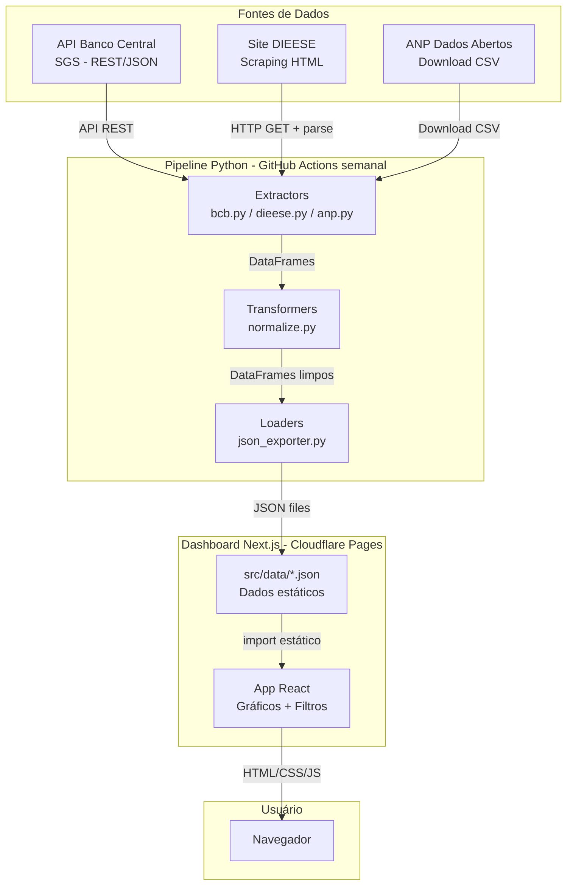
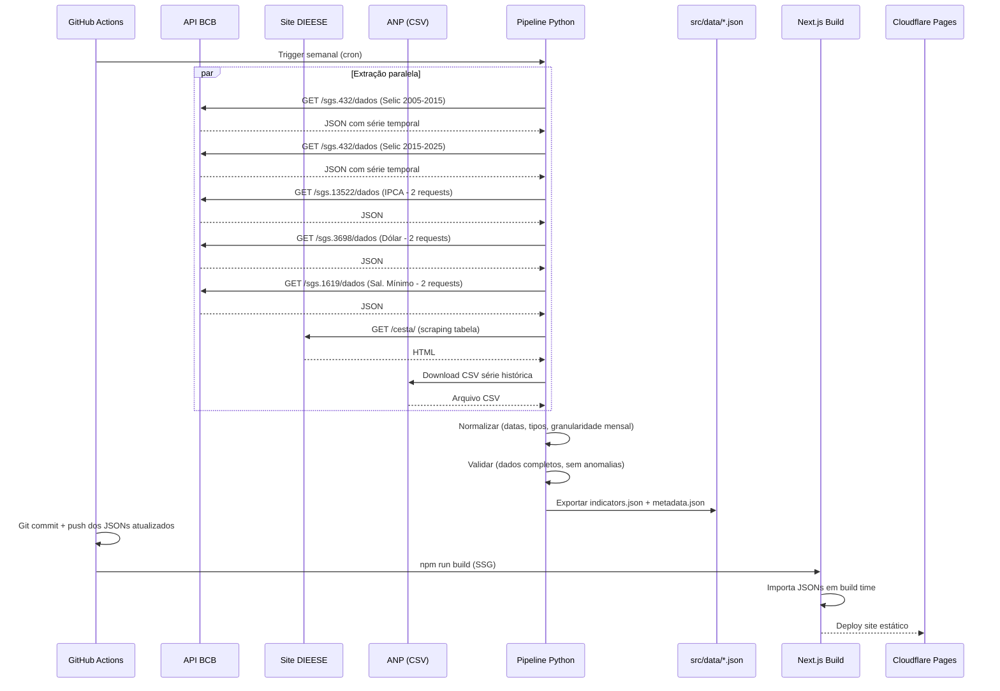
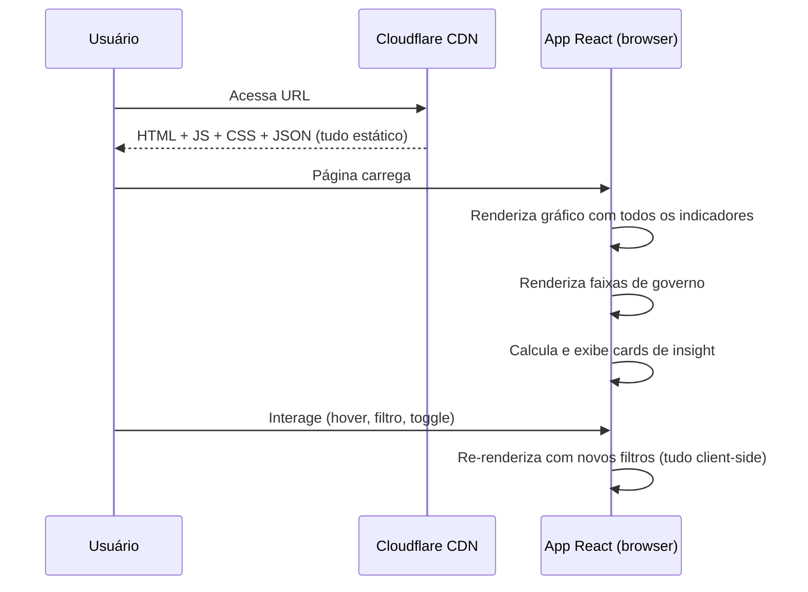
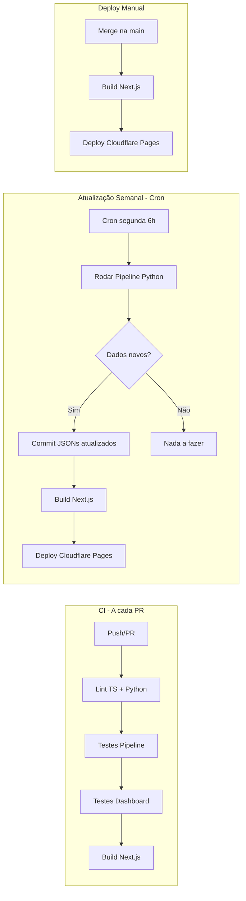

# ARCHITECTURE.md — Custo de Vida do Brasileiro

**Versão:** 1.0
**Última atualização:** 12/03/2026

---

## 1. Visão Geral

O sistema é dividido em duas partes independentes: um **pipeline ETL em Python** que coleta, transforma e exporta dados econômicos de 3 fontes públicas, e um **dashboard estático em Next.js** que consome esses dados como arquivos JSON e renderiza visualizações interativas. Não existe backend rodando em tempo real — o site inteiro é HTML/CSS/JS estático servido por CDN.

**Tipo de arquitetura:** Estática com pipeline offline (JAMstack)

### Diagrama geral



---

## 2. Componentes

### 2.1 Pipeline ETL (Python)

| Aspecto | Detalhe |
|---------|---------|
| **Responsabilidade** | Coletar dados das 3 fontes, normalizar e exportar como JSON estático |
| **Tecnologia** | Python 3.11+, Pandas, Requests, BeautifulSoup4 |
| **Localização no código** | `pipeline/` |
| **Comunica com** | APIs externas (BCB, DIEESE, ANP) → gera arquivos em `src/data/` |
| **Execução** | GitHub Actions (cron semanal) ou manual via `python main.py` |

**Subcomponentes:**

| Módulo | Arquivo | Responsabilidade |
|--------|---------|-----------------|
| Extrator BCB | `extractors/bcb.py` | Consulta API SGS pra Selic, IPCA, Dólar, Salário Mínimo |
| Extrator DIEESE | `extractors/dieese.py` | Faz scraping da cesta básica (São Paulo) |
| Extrator ANP | `extractors/anp.py` | Baixa e parseia CSV de preços de gasolina |
| Normalizador | `transformers/normalize.py` | Padroniza formatos, datas, tipos numéricos |
| Exportador | `loaders/json_exporter.py` | Gera JSONs otimizados pro frontend |
| Cliente HTTP | `utils/http_client.py` | Wrapper de requests com retry e backoff |

### 2.2 Dashboard (Next.js)

| Aspecto | Detalhe |
|---------|---------|
| **Responsabilidade** | Renderizar visualizações interativas dos dados econômicos |
| **Tecnologia** | Next.js 14 (App Router), TypeScript, Tailwind, Recharts |
| **Localização no código** | `src/` |
| **Comunica com** | Arquivos JSON estáticos em `src/data/` (import em build time) |
| **Estado** | React state local (useState/useReducer) — sem estado global |
| **Build** | `next export` gera site 100% estático (HTML/CSS/JS) |

### 2.3 Dados Estáticos (JSON)

| Aspecto | Detalhe |
|---------|---------|
| **Responsabilidade** | Armazenar dados processados prontos pro consumo do frontend |
| **Localização no código** | `src/data/` |
| **Formato** | JSON tipado |
| **Atualização** | Semanal via pipeline Python |
| **Versionamento** | Commitados no Git (são pequenos, ~100KB total) |

### 2.4 CI/CD (GitHub Actions)

| Aspecto | Detalhe |
|---------|---------|
| **Responsabilidade** | Automatizar atualização de dados e deploy |
| **Localização no código** | `.github/workflows/` |
| **Workflows** | `update-data.yml` (cron semanal) + `ci.yml` (PRs) |
| **Deploy** | Cloudflare Pages via Wrangler CLI |

---

## 3. Fluxo de Dados

### Fluxo principal — Pipeline de atualização semanal



### Fluxo do usuário — Explorar dashboard



---

## 4. Modelo de Dados

Este projeto não usa banco de dados. Os dados são arquivos JSON estáticos. Abaixo está o schema desses arquivos.

### Schema: `indicators.json`

Arquivo principal com todos os dados de indicadores.

```typescript
// Estrutura do indicators.json
interface IndicatorsData {
  lastUpdated: string;          // ISO 8601: "2026-03-12T10:00:00Z"
  period: {
    start: string;              // "2005-01"
    end: string;                // "2025-12"
  };
  indicators: {
    selic: MonthlyDataPoint[];
    ipca: MonthlyDataPoint[];
    dolar: MonthlyDataPoint[];
    salarioMinimo: MonthlyDataPoint[];
    cestaBasica: MonthlyDataPoint[];
    gasolina: MonthlyDataPoint[];
  };
}

interface MonthlyDataPoint {
  date: string;                 // Formato "YYYY-MM" (ex: "2024-03")
  value: number;                // Valor numérico (ex: 13.75, 4.62, 5.12)
}
```

**Exemplo concreto:**
```json
{
  "lastUpdated": "2026-03-12T10:00:00Z",
  "period": { "start": "2005-01", "end": "2025-12" },
  "indicators": {
    "selic": [
      { "date": "2005-01", "value": 18.25 },
      { "date": "2005-02", "value": 18.75 }
    ],
    "ipca": [
      { "date": "2005-01", "value": 7.41 },
      { "date": "2005-02", "value": 7.08 }
    ],
    "dolar": [
      { "date": "2005-01", "value": 2.6248 },
      { "date": "2005-02", "value": 2.5972 }
    ],
    "salarioMinimo": [
      { "date": "2005-01", "value": 260.00 },
      { "date": "2005-05", "value": 300.00 }
    ],
    "cestaBasica": [
      { "date": "2005-01", "value": 196.59 }
    ],
    "gasolina": [
      { "date": "2005-01", "value": 2.324 }
    ]
  }
}
```

### Schema: `governments.json`

Períodos de governo pra renderizar as faixas no gráfico.

```typescript
interface GovernmentsData {
  governments: GovernmentPeriod[];
}

interface GovernmentPeriod {
  id: string;                   // Identificador único (ex: "lula1")
  name: string;                 // Nome de exibição (ex: "Lula 1")
  president: string;            // Nome do presidente
  start: string;                // "YYYY-MM" (ex: "2003-01")
  end: string;                  // "YYYY-MM" (ex: "2006-12")
  color: string;                // Cor hex pra faixa (ex: "#E3342F")
}
```

### Schema: `metadata.json`

Informações sobre as fontes e última atualização.

```typescript
interface MetadataData {
  lastUpdated: string;
  sources: Source[];
  indicatorsMeta: Record<string, IndicatorMeta>;
}

interface Source {
  id: string;                   // "bcb" | "dieese" | "anp"
  name: string;                 // Nome da fonte
  url: string;                  // URL da fonte
  lastFetch: string;            // Quando foi a última coleta
  status: "success" | "error";  // Status da última coleta
}

interface IndicatorMeta {
  label: string;                // Nome de exibição (ex: "Taxa Selic")
  shortLabel: string;           // Rótulo curto (ex: "Selic")
  unit: string;                 // Unidade (ex: "% a.a.", "R$", "R$/litro")
  source: string;               // ID da fonte ("bcb", "dieese", "anp")
  description: string;          // Descrição curta do indicador
  color: string;                // Cor hex no gráfico
  frequency: string;            // "mensal"
  totalPoints: number;          // Quantidade de pontos de dados
  latestValue: number;          // Último valor disponível
  latestDate: string;           // Data do último valor
}
```

---

## 5. API / Endpoints

Este projeto não expõe API própria. O dashboard é 100% estático.

Os dados são consumidos em build time via import dos JSONs:

```typescript
// Em qualquer componente ou page do Next.js
import indicatorsData from '@/data/indicators.json';
import governmentsData from '@/data/governments.json';
import metadataData from '@/data/metadata.json';
```

---

## 6. Integrações Externas

### 6.1 Banco Central do Brasil — API SGS

| Aspecto | Detalhe |
|---------|---------|
| **Documentação** | https://dadosabertos.bcb.gov.br |
| **Autenticação** | Nenhuma — API pública |
| **Rate limits** | Não documentado oficialmente. Usar intervalo de 1s entre requests. |
| **Endpoint padrão** | `https://api.bcb.gov.br/dados/serie/bcdata.sgs.{codigo}/dados?formato=json&dataInicial={dd/MM/aaaa}&dataFinal={dd/MM/aaaa}` |
| **Limitação** | Máximo de 10 anos por requisição (desde março/2025) |
| **Formato de resposta** | JSON: `[{"data": "dd/MM/aaaa", "valor": "string_numero"}]` |
| **Tratamento de erros** | Retry 3x com backoff exponencial (2s, 4s, 8s). Se falhar, usa cache local. |
| **Séries usadas** | 432 (Selic Meta), 13522 (IPCA 12m), 3698 (Dólar compra), 1619 (Salário Mínimo) |

**Estratégia pra 20 anos:** Fazer 2 requests por série (2005-2015 e 2015-2025), concatenar os resultados e deduplicar pela data.

### 6.2 DIEESE — Cesta Básica

| Aspecto | Detalhe |
|---------|---------|
| **Documentação** | https://www.dieese.org.br/analisecestabasica/analiseCestaBasica.html |
| **Autenticação** | Nenhuma |
| **Método** | Web scraping da tabela HTML em https://www.dieese.org.br/cesta/ |
| **Alternativa** | Lib Python `calculadora-do-cidadao` (wrapper que faz o scraping) |
| **Dados extraídos** | Valor da cesta básica em São Paulo (R$), mensal |
| **Formato** | Tabela HTML com cidades nas colunas e meses nas linhas |
| **Tratamento de erros** | Se scraping falhar, manter dados anteriores e logar warning |
| **Risco** | Estrutura HTML pode mudar. Seletores devem ser resilientes. |

### 6.3 ANP — Preço de Combustíveis

| Aspecto | Detalhe |
|---------|---------|
| **Documentação** | https://www.gov.br/anp/pt-br/centrais-de-conteudo/dados-abertos/serie-historica-de-precos-de-combustiveis |
| **Autenticação** | Nenhuma |
| **Método** | Download de arquivos CSV (série histórica por semestre) |
| **Dados extraídos** | Preço médio de revenda da gasolina comum (R$/litro), agregado mensal nacional |
| **Formato** | CSV com colunas: região, estado, município, produto, data, preço médio revenda |
| **Processamento** | Filtrar por "GASOLINA COMUM", agrupar por mês, calcular média nacional |
| **Tratamento de erros** | Se download falhar, usar último CSV válido cacheado |
| **Volume** | CSVs são grandes (~50MB por semestre). Cachear localmente. |

---

## 7. Decisões Técnicas

### DT-01: Site estático (SSG) em vez de SSR ou SPA com API

| Aspecto | Detalhe |
|---------|---------|
| **Decisão** | Usar Next.js com `output: 'export'` gerando HTML estático |
| **Alternativas** | SSR com API route buscando dados em tempo real; SPA pura com fetch client-side |
| **Motivo** | Dados mudam 1x/mês no máximo. Não faz sentido ter servidor rodando. Estático = rápido, grátis (Cloudflare Pages), e simples. |
| **Consequências** | Positivo: performance máxima, custo zero, SEO nativo. Negativo: atualização requer rebuild. |

### DT-02: Pipeline Python separado do Next.js

| Aspecto | Detalhe |
|---------|---------|
| **Decisão** | ETL em Python puro, desacoplado do Next.js |
| **Alternativas** | ETL em TypeScript dentro do Next.js (API routes ou script Node) |
| **Motivo** | Python é a linguagem padrão pra ETL/dados. Pandas é muito superior a qualquer lib JS pra manipulação de dados. Demonstra versatilidade no portfólio. |
| **Consequências** | Positivo: melhor ferramenta pro job, mostra skill em Python. Negativo: 2 runtimes no projeto (Python + Node). |

### DT-03: Monorepo em vez de repos separados

| Aspecto | Detalhe |
|---------|---------|
| **Decisão** | Pipeline e dashboard no mesmo repositório |
| **Alternativas** | Repo separado pra pipeline e pra dashboard |
| **Motivo** | Um link pro LinkedIn é mais forte. CI/CD simplificado. O pipeline gera dados que o dashboard consome — faz sentido estarem juntos. |
| **Consequências** | Positivo: simplicidade, um README conta toda a história. Negativo: repo maior, dois runtimes no CI. |

### DT-04: Recharts em vez de D3.js

| Aspecto | Detalhe |
|---------|---------|
| **Decisão** | Usar Recharts pra gráficos |
| **Alternativas** | D3.js (mais poderoso), Chart.js (mais popular) |
| **Motivo** | Recharts é nativo React (componentes JSX), gera menos código, e cobre 100% das visualizações que precisamos (linhas temporais, áreas, tooltips). D3 seria overkill e geraria código mais complexo sem benefício visual. |
| **Consequências** | Positivo: menos código, integração natural com React, manutenção simples. Negativo: menos customizável que D3 se precisar de visualizações exóticas (não é o caso). |

### DT-05: Dados commitados no Git em vez de storage externo

| Aspecto | Detalhe |
|---------|---------|
| **Decisão** | Arquivos JSON vivem no repositório, commitados normalmente |
| **Alternativas** | S3/R2, Supabase Storage, GitHub Releases |
| **Motivo** | Volume total < 200KB. Não justifica infraestrutura extra. Build do Next.js importa diretamente. Histórico de dados fica no Git. |
| **Consequências** | Positivo: zero dependências externas, versionamento gratuito, build simples. Negativo: cada atualização semanal cria um commit (aceitável). |

### DT-06: GitHub Actions em vez de Trigger.dev

| Aspecto | Detalhe |
|---------|---------|
| **Decisão** | Usar GitHub Actions com cron pra automatizar o pipeline |
| **Alternativas** | Trigger.dev (plano free), n8n, cron em VPS |
| **Motivo** | Já está integrado ao repo, gratuito pra repos públicos, zero configuração extra. Pipeline é simples (1 job, 1x/semana). |
| **Consequências** | Positivo: nenhuma dependência nova, tudo no mesmo lugar. Negativo: menos features que Trigger.dev se o pipeline ficasse complexo (não é o caso). |

---

## 8. Infraestrutura e Deploy

### Ambientes

| Ambiente | URL | Hospedagem | Branch |
|----------|-----|-----------|--------|
| Desenvolvimento | localhost:3000 | Local | qualquer |
| Produção | (domínio do usuário) | Cloudflare Pages | main |

### Pipeline de deploy



### GitHub Actions — `update-data.yml`

```yaml
# Pseudocódigo do workflow
name: Atualizar Dados
on:
  schedule:
    - cron: '0 9 * * 1'  # Toda segunda às 9h UTC (6h BRT)
  workflow_dispatch:        # Permite rodar manualmente

jobs:
  update:
    runs-on: ubuntu-latest
    steps:
      - Checkout repo
      - Setup Python 3.11
      - Instalar dependências pipeline
      - Rodar pytest (pipeline)
      - Rodar python pipeline/main.py
      - Verificar se JSONs mudaram (git diff)
      - Se mudaram: commit + push
      - Setup Node.js 20
      - npm install
      - npm run build
      - Deploy pro Cloudflare Pages (wrangler)
```

### GitHub Actions — `ci.yml`

```yaml
# Pseudocódigo do workflow
name: CI
on: [pull_request]

jobs:
  test:
    runs-on: ubuntu-latest
    steps:
      - Checkout
      - Setup Python + Node
      - Rodar testes Python (pytest)
      - Rodar lint + typecheck + testes Next.js
      - Rodar build (garante que compila)
```

---

## 9. Segurança

- [x] Nenhuma variável sensível (todas as APIs são públicas)
- [x] Nenhuma autenticação necessária
- [x] Nenhum dado de usuário coletado ou armazenado
- [x] Site servido via HTTPS (Cloudflare Pages)
- [x] Sem banco de dados exposto
- [x] Sem formulários ou inputs do usuário
- [ ] Configurar CSP headers no Cloudflare (Content Security Policy)
- [ ] Configurar rate limiting no Cloudflare pra proteção contra DDoS (free tier já inclui)

---

## 10. Limitações Conhecidas

| # | Limitação | Motivo | Impacto |
|---|-----------|--------|---------|
| L01 | API do BCB limita consultas a 10 anos por request | Mudança da API em março/2025 | Pipeline faz 2 requests por série. Funciona, mas dobra as chamadas. |
| L02 | Cesta básica só pra São Paulo | DIEESE não tem API — scraping de 1 cidade é mais confiável | Não representa Brasil inteiro. Documentar no dashboard. |
| L03 | Gasolina usa média nacional, não por estado | Simplificação — CSVs por estado são muito grandes | Perde granularidade regional. Aceitável pro escopo. |
| L04 | Salário mínimo tem poucos pontos (muda ~1x/ano) | É assim que funciona — só muda por decreto | Gráfico mostra "escada". Normal e esperado. |
| L05 | DIEESE pode mudar HTML e quebrar scraping | Não há API oficial | Ter fallback com último dado válido. |
| L06 | Dados não são real-time (atualização semanal) | Decisão de arquitetura (site estático) | Pra dados mensais, semanal é mais que suficiente. |
| L07 | Sem modo offline | Site estático sem service worker | Precisa de internet. Aceitável. |
